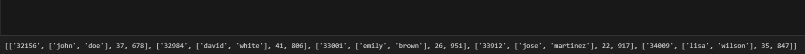

# 📊 Customer Analytics & Automated Extraction Tool: Store 1

## 🎯 Visión General
Este proyecto representa la fase de **Ingeniería Analítica** para "Store 1". Tras asegurar la calidad de los datos, el enfoque se desplazó hacia la creación de un motor de análisis basado en **Programación Funcional**. El objetivo fue desarrollar herramientas reutilizables que permitan extraer *insights* estratégicos y segmentar la base de clientes de forma automatizada.

## 🧱 Implementación Técnica: Programación Funcional
A diferencia de scripts lineales, este proyecto implementa un enfoque modular, permitiendo que las herramientas de análisis sean escalables y fáciles de mantener.

### Capacidades del Motor Analítico:
* **Encapsulamiento de Lógica (UDFs):** Creación de funciones de usuario (como `clean_user`) que actúan como microservicios de limpieza dentro del flujo de datos.
* **Procesamiento de Estructuras Complejas:** Manejo de datos anidados para realizar cálculos de ingresos agregados y métricas de comportamiento.
* **Simulación de Escenarios de Negocio:** Uso de lógica iterativa (`while loops`) y librerías estadísticas (`random`) para modelar proyecciones de gasto y comportamiento de compra.

## 🔍 Algoritmos de Segmentación y Extracción
El motor analítico permite realizar consultas complejas basadas en múltiples dimensiones de negocio:

| Segmento | Lógica de Extracción | Objetivo de Negocio |
| :--- | :--- | :--- |
| **High-Value Youth** | Edad < 30 & Gasto > $1000 | Identificación de perfiles con alto LTV potencial. |
| **Categorical Affinity** | Filtrado por `fav_categories` | Campañas de marketing dirigidas por intereses específicos. |
| **Revenue Aggregation** | Reducción de listas anidadas | Cálculo en tiempo real de los ingresos totales de la unidad. |

## 🛠️ Stack Tecnológico
* **Lenguaje:** Python 3.12.x
* **Lógica Avanzada:** Funciones `def`, Control de flujo (If/Else), Bucles de alto rendimiento (For/While).
* **Manejo de Datos:** Operaciones nativas de listas (`append`, `pop`, `sum`) optimizadas para velocidad de ejecución.

## 💡 Impacto en el Negocio
La creación de la función `get_client_by_cat` permite a la dirección de "Store 1" obtener reportes instantáneos de clientes clave sin necesidad de realizar consultas manuales. Esto reduce el tiempo de **Data-to-Insight**, permitiendo una toma de decisiones basada en datos reales y segmentados.
Automated Customer Segmentation Engine
To optimize marketing efforts, I developed a modular extraction tool that filters the customer base by specific attributes (age, spending, and interest categories).

Core Logic:

# Function to extract high-value segments by category
def get_client_by_cat(users_list, category):
    return [user for user in users_list if category in user['fav_categories']]

# Example usage: Identifying 'Clothes' enthusiasts
clothes_segment = get_client_by_cat(users_list, 'clothes')
Output Preview: Figure 1: Automated extraction of customers interested in the 'Clothes' category for targeted campaigns.

